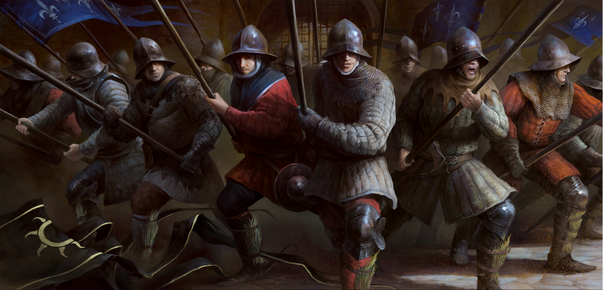

---
layout:
  title:
    visible: true
  description:
    visible: true
  tableOfContents:
    visible: true
  outline:
    visible: true
  pagination:
    visible: true
---

# Добро пожаловать!

<figure><figcaption></figcaption></figure>

**Мы рады представить вам русскоязычную комьюнити документацию по RedKit 3 для нашего проекта W3 Community DLC.**&#x20;

Это уникальная возможность внести свой вклад в развитие и усовершенствование проекта и всего моддерского сообщества. Документация полностью открыта для всех желающих, и каждый может поделиться своими знаниями и опытом, помогая другим участникам сообщества.

Чтобы пополнять документацию своими знаниями - вам необходимо заполнить [форму](https://forms.gle/KRvG5mm4xgXzi8ut9). После этого вы получите доступ к заданиям по пополнению документации (выбрать можете на свой вкус). \
\
Redkit 3 позволяет добавлять новые квесты, миры, катсцены, персонажей, NPC, записи в дневнике и диалоги. Возможностей много, но во всём нужно разбираться - так давайте же сделаем это вместе!

Мы с нетерпением ждем ваших идей и предложений, чтобы сделать наш проект еще более интересным и полезным для всех участников.&#x20;

**Присоединяйтесь к нам и делитесь своими опытом с другими!**
